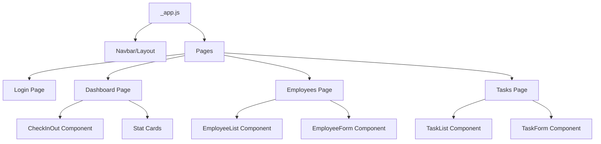
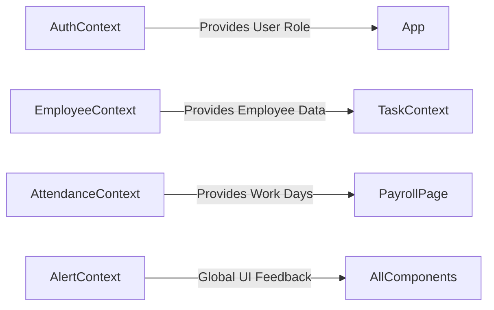

# 2. System Architecture

## 2.1 High-Level Design
The Employee Management System follows a **Client-Side MVC (Model-View-Controller)** pattern adapted for React:
- **Model**: React Contexts (`EmployeeContext`, `AttendanceContext`) serve as the data layer.
- **View**: Next.js Pages and Reusable Components render the UI.
- **Controller**: Custom Hooks (`useAuth`, `useTasks`) handle business logic and user input.

## 2.2 Component Hierarchy
The UI is composed of atomic components assembled into pages.



## 2.3 Data Flow & State Management
We utilize a **Unidirectional Data Flow**. State is hoisted to Context Providers, and changes propagate down via props or hooks.

### 2.3.1 Context Dependencies


## 2.4 Directory Structure
A scalable folder structure is used to allow for future growth:

```text
/src
├── components/          # Reusable UI Components
│   ├── attendance/      # (e.g., AttendanceTable, CheckInOut)
│   ├── common/          # (e.g., Navbar, Modal, Alert)
│   ├── employees/       # (e.g., EmployeeForm, EmployeeList)
│   └── tasks/           # (e.g., TaskList, TaskForm)
├── context/             # Global State Providers
│   ├── AuthContext.js
│   ├── EmployeeContext.js
│   ├── AttendanceContext.js
│   └── ...
├── data/                # Static & Mock Data
├── pages/               # Next.js Routes
├── styles/              # Global CSS & Tailwind Config
└── utils/               # Helper Functions
    ├── pdfGenerator.js  # PDF Logic
    └── dateUtils.js     # Date Formatting
```
