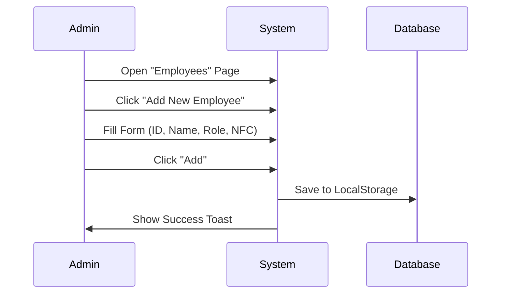
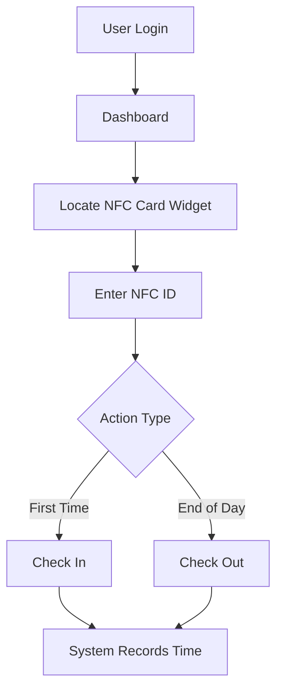

# 3. User Manual

## 3.1 Overview
This manual provides actionable instructions for all system users, categorized by role.

---

## 3.2 Admin & HR Operations

### 3.2.1 Workflow: Employee Onboarding

### 3.2.2 Payroll Processing
1.  **Prerequisite**: Ensure employees have marked attendance for the month (or mock data is populated).
2.  **Navigate**: Go to the **Payroll** tab.
3.  **Review**: Check the "Days Present" column.
4.  **Process**: Click **"Process Current Month Payroll"**.
    - *System Note*: This snapshotizes the current attendance data for the month.
5.  **Export**: Click the **Download (PDF)** icon to generate a formal payslip.

---

## 3.3 Employee Operations

### 3.3.1 Workflow: Daily Attendance

### 3.3.2 Managing Tasks
- **View Tasks**: Go to the **Tasks** page to see items assigned to you.
- **Update Status**: 
    - **Open**: Task has not started.
    - **In Progress**: You are actively working on it.
    - **Completed**: Work is finished.

## 3.4 Common Troubleshooting

| Symptom | Probable Cause | Solution |
|:---|:---|:---|
| **"User not found"** during login | Incorrect ID | Use mock IDs like `EMP001` (Admin) or `EMP003` (Employee). |
| **NFC Check-in Fail** | Wrong NFC ID | Ensure you type the NFC ID assigned to your profile (e.g., `NFC003`). |
| **Data Disappears** | Browser Cleared | Data is stored in `localStorage`. Clearing cache wipes the database. |
